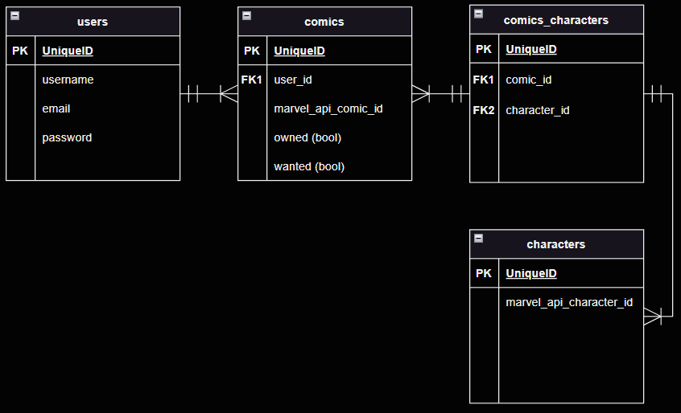

# comics collection app

## Description

My project is a collection tracker for comic books published by Marvel. Users will be able to search for various issues across all Marvel series and add them as owned or wanted. This is inspired by an issue from my own life: I've got a box with a ton of unorganized issues in my closet and have given up on figuring out which ones I have (I have duplicates of a few!) and which ones I'd like to buy to fill in the gaps.

Beyond my own disorganization, Marvel has frequently ended series and started new series with the same characters over the last few years, making it extremely frustrating to keep tabs on where your favorite characters are showing up. My project seeks to leverage Marvel's own API as the source of authority for which titles are relevant for a specific character, making it much easier to pin down which titles you need to keep up with.

Ultimately, you'll be able to use my app to search for a character and get results (comic book series and/or individual issues) to be sure your collection can be comprehensive.

## API used

I'll be using the Marvel comics API. Example query: `https://gateway.marvel.com:443/v1/public/characters/1009610?ts=${timeStamp}&apikey=${pubKey}&hash=${hashedPayload}` will return information about Spider-Man.

## ERDs

# RESTful Route Chart

| VERB   | URL                           | CRUD    | DESCRIPTION                                                                                                   | VIEW                  |
|:------ |:----------------------------- |:------- |:------------------------------------------------------------------------------------------------------------- |:--------------------- |
| GET    | /                             | Read    | Home View                                                                                                     | Home                  |
|        |                               |         |                                                                                                               |                       |
| GET    | /users/new                    | Read    | Display signup form                                                                                           | Signup form           |
| GET    | /users/login                  | Read    | Display login form                                                                                            | Login form            |
| POST   | /users                        | Create  | Add user data to db                                                                                           | Home                  |
| POST   | /users/login                  | Read    | Checks user credentials against db                                                                            | Home                  |
| GET    | /users/logout                 | Read    | Logout user by clearing cookies                                                                               | Home                  |
| GET    | /users/:username/:destination | Read    | General-purpose route to retrieve resources for a specific user: profile, collection, wishlist, or pull list  | Destination           |
| POST   | /users/:username/:destination | Create  | General-purpose route to create to resources for a specific user: profile, collection, wishlist, or pull list | Current view          |
| PUT    | /users/:username/collection   | Update  | General-purpose route to create to resources for a specific user: profile, collection, wishlist, or pull list | Current view          |
| DELETE | /users/:username/collection   | Destroy | Remove an entity from collection                                                                              | Collection            |
| DELETE | /users/:username/wishlist     | Destroy | Remove an entity from wishlist                                                                                | Wishlist              |
| DELETE | /users/:username/pull_list    | Destroy | Remove an entity from pull_list                                                                               | Pull list             |
|        |                               |         |                                                                                                               |                       |
| GET    | /search/comics                | Read    | Search form for searching specific comics issues                                                              | Comic search form     |
| GET    | /search/comics/results        | Read    | Results of comic search                                                                                       | Comic search results  |
| GET    | /search/series                | Read    | Search form for searching by series                                                                           | Series search form    |
| GET    | /search/series/results        | Read    | Results of series search                                                                                      | Series search results |

## Installation Instructions

- Fork/clone the repo
- Run `npm i`
- Run `npm i dotenv` (not required in production environment, but will be needed for a local deployment)
- Create a .env file in your repo and add it to your .gitignore; store your public and private Marvel API keys here with variable names `PUB_KEY` and `PRIV_KEY`
- In your .env file, create an encryption key named `ENC_KEY` for managing cookies

## User Stories

- _As a collector, I want to add comics I have to a personal collection._
- _As a collector, I want to add comics to a wishlist so that I can see which ones I'm still aiming to collect._
- _As a collector, I want to take a look at the newest issues of series in my pull list._
- _As an app user, I want to search for characters so that I can learn about new heroes and villains in the Marvel universe._

## MVP Goals

- User can create and delete account.
- User can change password.
- User can search for comics and add them to a list of favorite comics.
- User can search for comics and add them to a list of wanted comics.

## Stretch Goals

- User can search for characters and add them to a list of favorite characters.
- User can click on a search result (comic, character, etc) to navigate to a page where more comprehensive information about that individual item is displayed (character: first appearance, list of relevant series, etc).
- Include more robust search criteria to allow the user to benefit from the comprehensive information available via API query.
